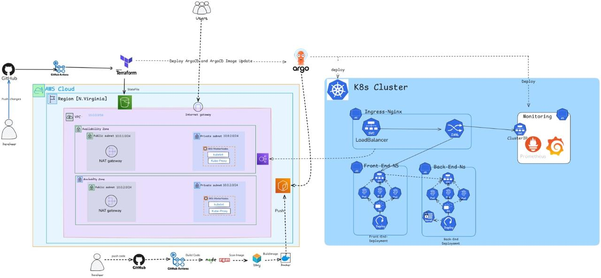
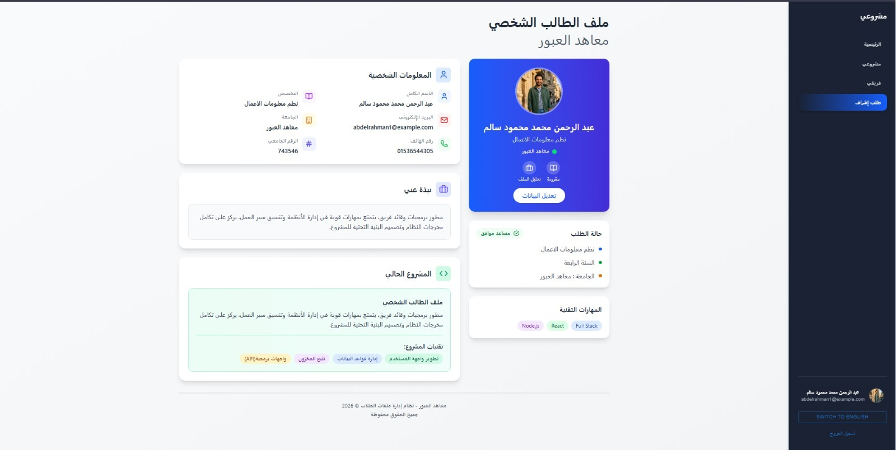
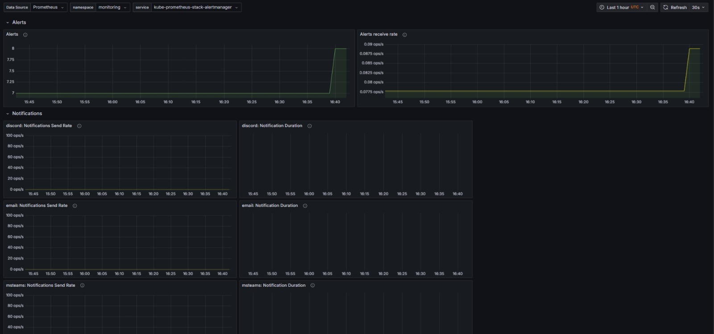
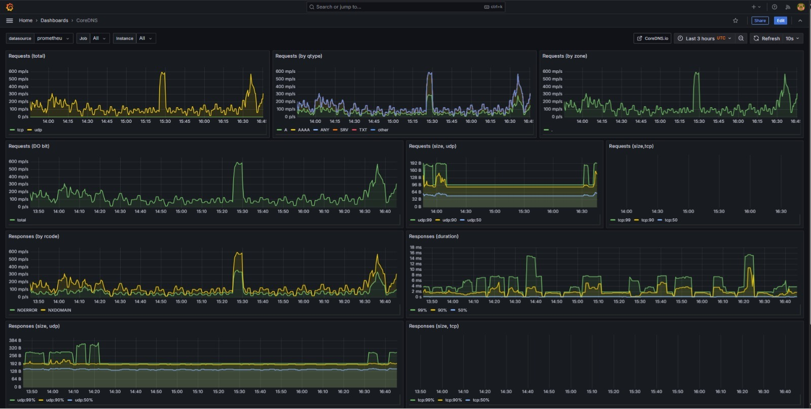
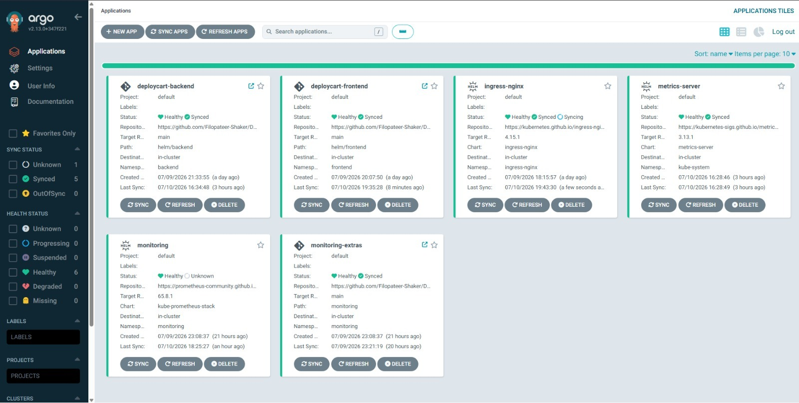

<div align="center">

#  DeployCart
### DEPI Capstone Project

**A production-oriented, cloud-native DevOps pipeline on AWS EKS —**
**Terraform · Docker · GitHub Actions · Helm · Argo CD · Prometheus · Grafana**

<br>


</div>

<br>

##  Table of Contents

<table>
<tr>
<td valign="top">

**Overview**
- [Project Overview](#-project-overview)
- [Architecture](#-architecture)
- [Main Features](#-main-features)
- [Technology Stack](#-technology-stack)
- [Repository Structure](#-repository-structure)

**Getting Started**
- [Prerequisites](#-prerequisites)
- [Infrastructure Deployment](#-infrastructure-deployment)
- [End-to-End Workflow](#-end-to-end-workflow)

</td>
<td valign="top">

**CI/CD**
- [Application CI Pipeline](#-application-ci-pipeline)
- [Application CD and GitOps](#-application-cd-and-gitops)
- [Kubernetes Networking](#-kubernetes-networking)

**Operations**
- [Monitoring and Observability](#-monitoring-and-observability)
- [Security Controls](#-security-controls)
- [Validation Commands](#-validation-commands)
- [Troubleshooting](#-troubleshooting)

</td>
<td valign="top">

**Reference**
- [Screenshots](#-screenshots)
- [Future Improvements](#-future-improvements)
- [Contributors](#-contributors)
- [License](#-license)

</td>
</tr>
</table>

---

##  Project Overview

**DeployCart** is a multi-tier Node.js web application deployed through a complete DevOps and GitOps workflow.

The project demonstrates how to:

| | |
|---|---|
|  | Provision AWS infrastructure using Terraform |
|  | Build, scan, and publish Docker images through GitHub Actions |
|  | Store container images in Amazon ECR |
|  | Deploy the frontend and backend to Amazon EKS using Helm |
|  | Continuously reconcile Kubernetes resources with Argo CD |
|  | Detect new ECR image versions using Argo CD Image Updater |
|  | Expose multiple services through one NGINX Ingress Controller and one AWS Load Balancer |
|  | Monitor the Kubernetes cluster using Prometheus and Grafana |
|  | Apply basic security controls to containers, Kubernetes resources, and the CI/CD workflow |

> The repository contains the application CI configuration, Kubernetes CD resources, monitoring configuration, and Terraform infrastructure code required to reproduce the environment.

---

##  Architecture

<div align="center">



</div>

### High-Level Request Flow

```text
User
  |
  v
AWS Load Balancer :80
  |
  v
NGINX Ingress Controller
  |
  +-- /          --> Frontend Service --> Frontend Pods
  +-- /api       --> Backend Service  --> Backend Pods
  +-- /grafana   --> Grafana Service
  +-- /argocd    --> Argo CD Server
```

### High-Level Delivery Flow

```text
Developer Push
      |
      v
GitHub Repository
      |
      v
GitHub Actions
  - Build
  - Test
  - SonarQube analysis
  - Trivy scan
  - Docker build
  - Push to Amazon ECR
      |
      v
Argo CD Image Updater
      |
      v
Argo CD
      |
      v
Helm Release on AWS EKS
```

---

##  Main Features

<table>
<tr>
<td valign="top" width="33%">

**Infrastructure**
- Infrastructure as Code using Terraform
- Remote Terraform state in Amazon S3
- Multi-AZ, highly available AWS network
- EKS cluster with private worker nodes
- Amazon ECR repositories

</td>
<td valign="top" width="33%">

**CI/CD**
- GitHub Actions CI pipelines
- SonarQube code-quality analysis
- Trivy vulnerability scanning
- Helm-based Kubernetes deployments
- Argo CD sync, self-healing & pruning
- Argo CD Image Updater integration

</td>
<td valign="top" width="33%">

**Runtime & Security**
- NGINX Ingress path-based routing
- Prometheus metrics & Grafana dashboards
- Resource requests/limits, probes
- Restricted service accounts
- Hardened container security contexts

</td>
</tr>
</table>

---

##  Technology Stack

| Area | Technologies |
|---|---|
|  Cloud Provider | AWS |
|  Infrastructure as Code | Terraform |
|  Containerization | Docker |
|  Container Registry | Amazon ECR |
|  Container Orchestration | Kubernetes / Amazon EKS |
|  Package Management | Helm |
|  Continuous Integration | GitHub Actions |
|  Continuous Delivery | Argo CD |
|  Image Automation | Argo CD Image Updater |
|  Security Scanning | Trivy |
|  Code Quality | SonarQube |
|  Ingress | NGINX Ingress Controller |
|  Monitoring | Prometheus |
|  Visualization | Grafana |
|  State Storage | Amazon S3 |
|  Application Runtime | Node.js |
|  Version Control | Git and GitHub |

---

##  Repository Structure

```text
Depi-Capstone-Project/
├── APP-CI/
│   ├── application source code
│   ├── Dockerfiles
│   ├── CI workflow configuration
│   └── application documentation
│
├── Application-CD/
│   ├── Helm charts
│   ├── Argo CD Applications
│   ├── Kubernetes manifests
│   ├── ingress resources
│   ├── monitoring resources
│   └── security configuration
│
├── Terrafrom/
│   ├── AWS provider configuration
│   ├── VPC and subnet modules
│   ├── EKS resources
│   ├── ECR resources
│   ├── IAM resources
│   ├── remote-state configuration
│   └── infrastructure workflow files
│
├── Architechtures_pictures/
│   ├── Architechture.png
│   ├── runningApp.jpeg
│   ├── Grafana.jpeg
│   ├── GrafanaVisuals.jpeg
│   └── ArgoCD.jpeg
│
└── README.md
```

>  The folder name `Terrafrom` is preserved because it matches the current repository structure.

### Main Directories

| Directory | Contains |
|---|---|
| [`APP-CI`](./APP-CI/) | Node.js application source, Docker build config, CI workflows, tests, code-quality checks, and container security scanning |
| [`Application-CD`](./Application-CD/) | Helm charts, Argo CD Application definitions, Kubernetes deployment resources, ingress config, monitoring, and security manifests |
| [`Terrafrom`](./Terrafrom/) | Terraform code provisioning AWS networking, Amazon EKS, Amazon ECR, IAM resources, and the remote-state backend |

---

##  End-to-End Workflow

### 1️ Infrastructure Provisioning

1. A developer updates the Terraform code.
2. The change is pushed to GitHub.
3. GitHub Actions runs Terraform validation and planning.
4. Terraform provisions or updates: VPC, public/private subnets, Internet Gateway, NAT Gateways, route tables, Amazon EKS, worker-node resources, Amazon ECR, and IAM roles/policies.
5. Terraform state is stored remotely in Amazon S3.

###  Continuous Integration

1. A developer pushes application code.
2. GitHub Actions checks out the repository.
3. Dependencies are installed.
4. The application is built and tested.
5. SonarQube analyzes code quality and maintainability.
6. Trivy scans the application or container image for vulnerabilities.
7. Docker builds a versioned image.
8. The image is pushed to Amazon ECR.

###  Continuous Delivery

1. Argo CD monitors the Git repository.
2. Argo CD Image Updater monitors ECR for valid image tags.
3. The required image version is updated in the application configuration.
4. Argo CD detects that the desired state changed.
5. Argo CD renders the Helm chart.
6. Kubernetes performs a rolling update.
7. Readiness probes determine when new Pods can receive traffic.
8. Argo CD reports synchronization and health status.

---

##  Prerequisites

<table>
<tr>
<td valign="top">

**Required**
- Git
- AWS CLI v2
- Terraform
- Docker
- kubectl
- Helm

</td>
<td valign="top">

**Optional but recommended**
- Argo CD CLI
- eksctl
- jq
- Trivy
- SonarScanner

</td>
</tr>
</table>

### Verify the Tools

```bash
aws --version
terraform version
docker --version
kubectl version --client
helm version
git --version
```

### AWS Authentication

```bash
aws configure
aws sts get-caller-identity
```

> The authenticated AWS identity must have the permissions required to manage the infrastructure defined in Terraform.

---

## Infrastructure Deployment

```bash
# Move to the infrastructure directory
cd Terrafrom

# Initialize Terraform
terraform init

# Validate the configuration
terraform fmt -check
terraform validate

# Review the proposed changes
terraform plan

# Apply the infrastructure
terraform apply
```

After the EKS cluster is created, configure kubectl:

```bash
aws eks update-kubeconfig \
  --region <AWS_REGION> \
  --name <EKS_CLUSTER_NAME>
```

Verify connectivity:

```bash
kubectl get nodes
kubectl get namespaces
```

<details>
<summary><strong> Destroying the Environment</strong></summary>

<br>

```bash
terraform destroy
```

>  Review the destroy plan carefully. This command can remove the EKS cluster, networking resources, and other AWS services managed by Terraform.

</details>

---

##  Application CI Pipeline

```text
Checkout → Install dependencies → Run tests → SonarQube analysis
   → Trivy vulnerability scan → Docker build
   → Authenticate to Amazon ECR → Push versioned image
```

### Recommended Image Tagging

 Use immutable and traceable tags such as `v1.0.0`, `v1.0.1`, `<git-commit-sha>`

 Avoid relying only on `latest` — it makes rollback and release identification more difficult.

### Required GitHub Secrets

The exact names depend on the workflow files, but common values include:

```text
AWS_REGION
AWS_ROLE_ARN
AWS_ACCESS_KEY_ID
AWS_SECRET_ACCESS_KEY
ECR_REPOSITORY
SONAR_HOST_URL
SONAR_TOKEN
```

>  Prefer GitHub OIDC and short-lived AWS credentials instead of permanent IAM access keys whenever possible.

---

## 🚢 Application CD and GitOps

Argo CD treats Git as the source of truth for Kubernetes resources.

### Argo CD Responsibilities

- Compares desired state in Git with live state in EKS
- Displays application health and synchronization state
- Applies Helm charts and Kubernetes manifests
- Automatically synchronizes approved changes
- Restores manually modified resources when self-healing is enabled
- Removes resources deleted from Git when pruning is enabled
- Provides deployment history and rollback visibility

### Common Argo CD Status Values

| Status | Meaning |
|---|---|
|  Synced | Live resources match Git |
|  OutOfSync | Git and live resources differ |
|  Healthy | Resources are operating normally |
|  Progressing | Deployment is still rolling out |
|  Degraded | One or more resources are unhealthy |
|  Missing | A required resource does not exist |

### Apply Argo CD Applications

```bash
# From the CD directory, apply the required Application manifests
kubectl apply -f Application-CD/

# Verify them
kubectl -n argocd get applications

# Force a refresh when needed
kubectl -n argocd annotate application <APPLICATION_NAME> \
  argocd.argoproj.io/refresh=hard \
  --overwrite
```

---

##  Kubernetes Networking

The frontend and backend are exposed through one NGINX Ingress Controller.

<table>
<tr>
<td valign="top" width="50%">

**Internal Services**
- Frontend service: `ClusterIP`
- Backend service: `ClusterIP`
- Grafana service: `ClusterIP`
- Argo CD service: internal service behind ingress

</td>
<td valign="top" width="50%">

**External Entry Point**

The NGINX Ingress Controller uses a Kubernetes Service of type `LoadBalancer`. AWS creates one external Load Balancer and all application paths share it.

</td>
</tr>
</table>

### Example Routing

| Path | Destination |
|---|---|
| `/` | Frontend |
| `/api` | Backend |
| `/grafana` | Grafana |
| `/argocd` | Argo CD |

### Request Path

```text
Client → AWS Load Balancer → NGINX Ingress Controller
       → Ingress rule → ClusterIP Service → Pod → Container
```

---

##  Monitoring and Observability

The monitoring stack includes:

| Component | Role |
|---|---|
| **Prometheus** | Time-series metric collection |
| **Grafana** | Dashboards and data visualization |
| **Alertmanager** | Alert routing |
| **Node Exporter** | Node-level metrics |
| **kube-state-metrics** | Kubernetes object-state metrics |
| **ServiceMonitor** | Prometheus Operator discovery |

<details>
<summary><strong> Useful PromQL Queries</strong></summary>

<br>

Check whether scrape targets are available:
```promql
up
```

Show only failed targets:
```promql
up == 0
```

Count running targets:
```promql
count(up == 1)
```

Display Kubernetes Pod status:
```promql
kube_pod_status_phase
```

Display container CPU usage:
```promql
rate(container_cpu_usage_seconds_total[5m])
```

Display container memory usage:
```promql
container_memory_working_set_bytes
```

</details>

### Prometheus Data Source URL

When Grafana and Prometheus are in the same Kubernetes cluster, use the internal Service DNS name, for example:

```text
http://<prometheus-service>.<namespace>.svc.cluster.local:9090
```

>  Do not use `localhost:9090` unless Prometheus runs inside the same Pod.

---

##  Security Controls

<table>
<tr>
<td valign="top" width="33%">

**CI Security**
- SonarQube static analysis
- Trivy vulnerability scanning
- Versioned container images
- Controlled registry publication
- GitHub Secrets for pipeline values

</td>
<td valign="top" width="33%">

**AWS Security**
- Worker nodes in private subnets
- Least-privilege IAM roles
- Private Amazon ECR repositories
- Remote Terraform state in S3
- Security groups controlling access

</td>
<td valign="top" width="33%">

**Kubernetes Security**
- Namespace separation
- Kubernetes Secrets for backend values
- Resource requests and limits
- Readiness/liveness probes
- Restricted security contexts
- Dropped Linux capabilities

</td>
</tr>
</table>

>  **Secret-Management Note:** Kubernetes Secrets are Base64-encoded by default; Base64 is **not** encryption. For production, use AWS Secrets Manager, AWS SSM Parameter Store, External Secrets Operator, Sealed Secrets, or AWS KMS encryption at rest. Never commit real credentials, passwords, tokens, or private keys to Git.

---

##  Validation Commands

<details>
<summary><strong>Cluster</strong></summary>

```bash
kubectl get nodes -o wide
kubectl get namespaces
kubectl get pods -A
```
</details>

<details>
<summary><strong>Deployments and Services</strong></summary>

```bash
kubectl get deployments -A
kubectl get services -A
kubectl get endpoints -A
```
</details>

<details>
<summary><strong>Ingress</strong></summary>

```bash
kubectl get ingress -A
kubectl describe ingress -n <NAMESPACE> <INGRESS_NAME>
```
</details>

<details>
<summary><strong>Argo CD</strong></summary>

```bash
kubectl -n argocd get applications
kubectl -n argocd get pods
```
</details>

<details>
<summary><strong>Monitoring</strong></summary>

```bash
kubectl -n monitoring get pods
kubectl -n monitoring get services
kubectl -n monitoring get servicemonitors
```
</details>

<details>
<summary><strong>Resource Usage</strong></summary>

```bash
kubectl top nodes
kubectl top pods -A
```
</details>

<details>
<summary><strong>Logs & Rollout Status</strong></summary>

```bash
kubectl logs -n <NAMESPACE> deployment/<DEPLOYMENT_NAME> --tail=200

kubectl rollout status \
  -n <NAMESPACE> \
  deployment/<DEPLOYMENT_NAME>
```
</details>

---

## 🛠️ Troubleshooting

<details>
<summary><strong> CrashLoopBackOff</strong></summary>

<br>

Inspect the Pod and logs:
```bash
kubectl describe pod -n <NAMESPACE> <POD_NAME>
kubectl logs -n <NAMESPACE> <POD_NAME> --previous
```

**Common causes:** missing environment variables, invalid Secret reference, application startup failure, database connection failure, incorrect port, failed liveness probe.

</details>

<details>
<summary><strong> ImagePullBackOff</strong></summary>

<br>

```bash
kubectl describe pod -n <NAMESPACE> <POD_NAME>
```

**Possible causes:** incorrect ECR image name/tag, missing ECR IAM permissions, image does not exist, network path to ECR unavailable.

</details>

<details>
<summary><strong> Ingress Returns 404</strong></summary>

<br>

A `404` from the application can mean the request successfully reached the backend, but the application route does not exist.

```bash
kubectl get ingress -A
kubectl get endpoints -n <NAMESPACE> <SERVICE_NAME>
kubectl logs -n <NAMESPACE> deployment/<DEPLOYMENT_NAME>
```

</details>

<details>
<summary><strong>Frontend Calls localhost</strong></summary>

<br>

For Vite applications, values such as `VITE_API_URL=http://localhost:3000` are embedded during the frontend build.

Pass the production URL during the Docker build:

```dockerfile
ARG VITE_API_URL
ENV VITE_API_URL=${VITE_API_URL}
RUN npm run build
```

```bash
docker build \
  --build-arg VITE_API_URL=http://<LOAD_BALANCER_DNS> \
  -t <ECR_REPOSITORY>:<TAG> .
```

</details>

<details>
<summary><strong> Grafana Login Fails After Reinstallation</strong></summary>

<br>

If Grafana uses persistent storage, the administrator password can remain in the Grafana database even when the Kubernetes Secret changes.

Reset it from the Grafana Pod:

```bash
kubectl -n monitoring exec <GRAFANA_POD> -c grafana -- \
  grafana cli \
  --homepath /usr/share/grafana \
  --config /etc/grafana/grafana.ini \
  admin reset-admin-password '<NEW_PASSWORD>'
```

</details>

<details>
<summary><strong> Argo CD Shows OutOfSync</strong></summary>

<br>

Check the Application conditions:

```bash
kubectl -n argocd get application <APPLICATION_NAME> -o yaml
```

Then perform a hard refresh:

```bash
kubectl -n argocd annotate application <APPLICATION_NAME> \
  argocd.argoproj.io/refresh=hard \
  --overwrite
```

</details>

---

##  Screenshots

<div align="center">

| Running Application | Grafana Dashboard |
|:---:|:---:|
|  |  |

| Grafana Cluster Visualizations | Argo CD Dashboard |
|:---:|:---:|
|  |  |

</div>

>  GitHub image paths are case-sensitive. Keep the image names and folder names exactly the same as they appear in the repository.

---

##  Future Improvements

- [ ] Configure a custom domain using Route 53
- [ ] Enable HTTPS using AWS Certificate Manager and cert-manager
- [ ] Add AWS WAF protection
- [ ] Use AWS Secrets Manager with External Secrets Operator
- [ ] Enable Horizontal Pod Autoscaling
- [ ] Add PodDisruptionBudgets
- [ ] Add topology-spread constraints across Availability Zones
- [ ] Add centralized logging using Loki, OpenSearch, or the ELK stack
- [ ] Add Alertmanager notification channels
- [ ] Add backup and disaster-recovery procedures
- [ ] Enable ECR lifecycle policies
- [ ] Sign images using Cosign
- [ ] Generate SBOM files in the CI pipeline
- [ ] Use GitHub OIDC instead of long-lived AWS credentials
- [ ] Add automated integration and performance tests
- [ ] Add Argo Rollouts for canary or blue/green deployment strategies
- [ ] Add TLS and authentication controls for Argo CD and Grafana

---

##  Contributors

This project was developed as a capstone project for the **Digital Egypt Pioneers Initiative (DEPI)**.

<div align="center">

<table>
<tr>
<td align="center">
<a href="https://github.com/Eng-abdelhamed">
<br>
<sub><b>Eng-abdelhamed</b></sub>
</a>
</td>
<td align="center">
<a href="https://github.com/Mazen2004212">
<br>
<sub><b>Mazen2004212</b></sub>
</a>
</td>
<td align="center">
<a href="https://github.com/aya-anwar22">
<br>
<sub><b>aya-anwar22</b></sub>
</a>
</td>
<td align="center">
<a href="https://github.com/Filopateer-Shaker">
<br>
<sub><b>Filopateer-Shaker</b></sub>
</a>
</td>
<td align="center">
<a href="https://github.com/seifahmedb">
<br>
<sub><b>seifahmedb</b></sub>
</a>
</td>
</tr>
</table>

</div>

---

##  License

No license is currently specified.

To define reuse and distribution permissions, add a `LICENSE` file such as MIT, Apache 2.0, or GPL v3.

---

<div align="center">

Built with Terraform · Docker · Kubernetes · AWS EKS · GitHub Actions · Argo CD · Prometheus · Grafana

</div>
